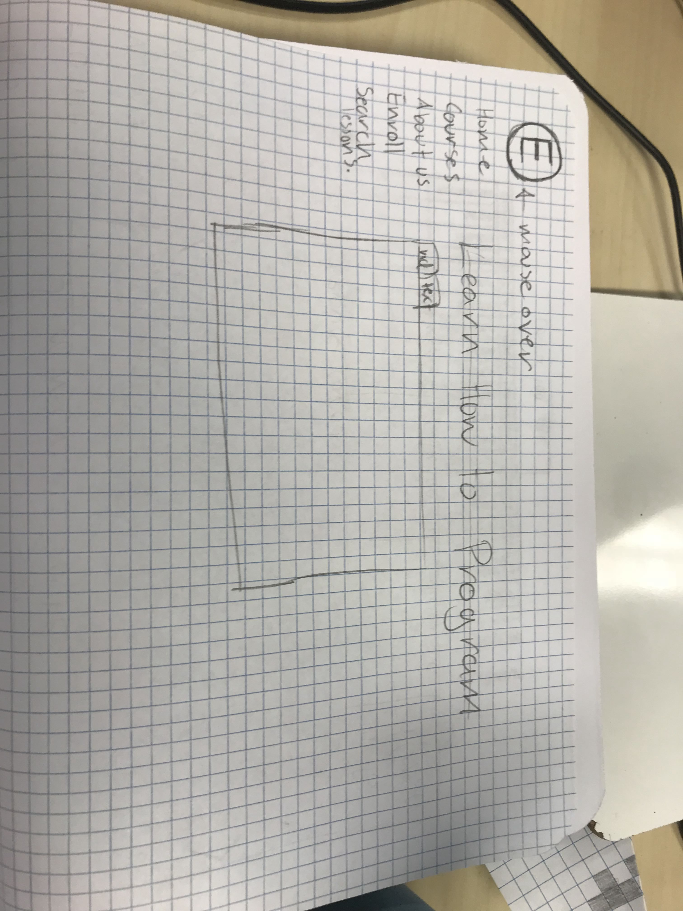
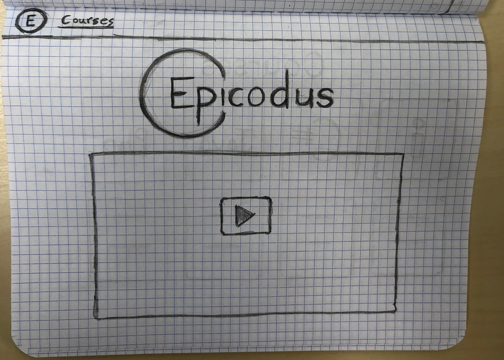
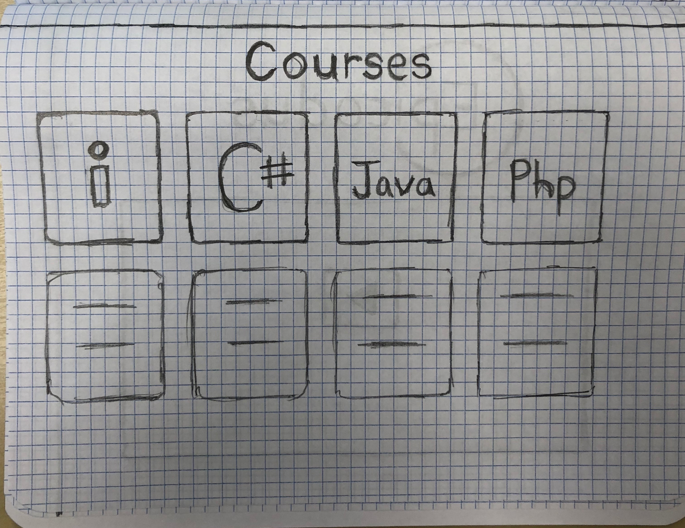
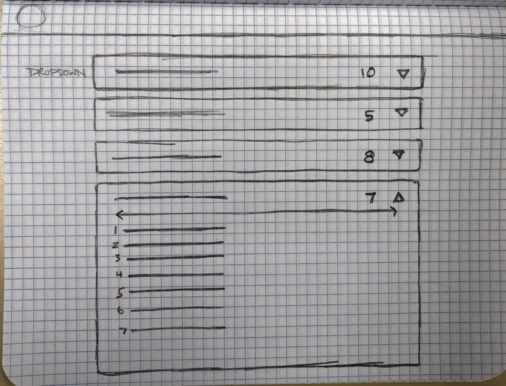

## Learnhowtoprogram.com Redesign
---

#### By Bobby Martin and Ami Cooper
#### 5.29.18

### Description

This is a project that represents obtained knowledge of Sketch App, Wireframing, and Prototyping

### Pencil sketches
#### Ami's Sketches

#### Bobby's Sketches

#### Desktop Version

#### Mobile Version

### Technologies and Resources

* Paper and Pencil
* Sketch 3

### Responsiveness

Describe how the site is responsive, and what different 'versions' this project includes (does it have a mobile version? tablet version? )

### Setup Instructions

Describe how someone can clone and launch this project.

### Roadmap

Is there work you plan on continuing doing on this project? Features you'd like to add?

* Consider
* Listing
* Them
* Here

### License

Determine the license under which this application can be used.

Copyright (c) 2018 **_{ List of contributors }_**
