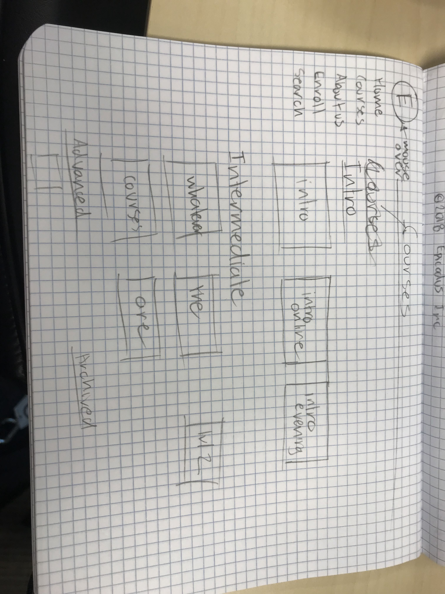

## Learnhowtoprogram.com Redesign
---

#### By Bobby Martin and Ami Cooper
#### 5.29.18

### Description

This is a project that represents obtained knowledge of Sketch App, Wireframing, and Prototyping

### Pencil sketches
#### Ami's Sketches

#### Bobby's Sketches

#### Desktop Version

#### Mobile Version

### Technologies and Resources

* Paper and Pencil
* Sketch 3

### License

Determine the license under which this application can be used.

Copyright (c) 2018 **_{ Bobby Martin and Ami Cooper }_**
